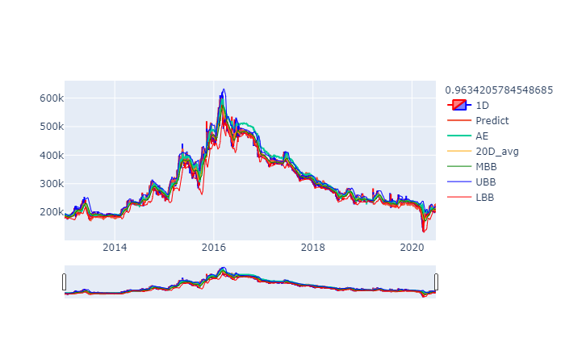
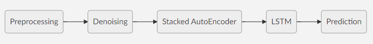
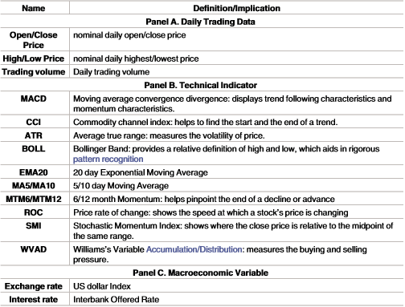
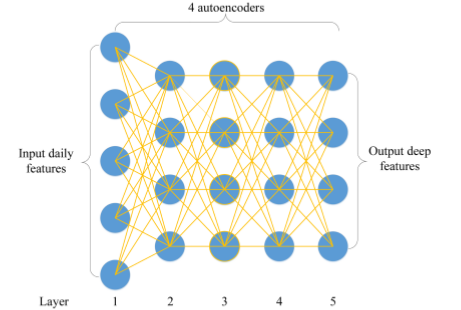
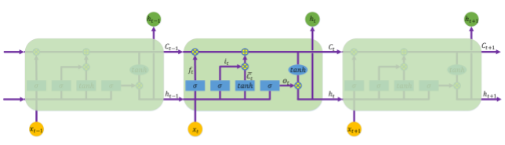

# A deep learning framework for financial time


주식 데이터 예측에 LSTM이 이전 종가를 그대로 다음 날 종가로 예측하는 lagging 현상을 줄이고자 위 논문을 재구현했습니다. 


### requirements.txt
-----
pandas~=1.0.3  
pyqt5~=5.15.0  
rootpath~=0.1.1  
numpy~=1.18.4  
plotly~=4.7.1  
tensorflow~=2.1.0  
dtw~=1.4.0  
scikit-learn~=0.23.1  
requests~=2.23.0  
beautifulsoup4~=4.9.1  
tqdm~=4.46.1  
keras~=2.3.1  
setuptools~=46.4.0  
statsmodels~=0.11.1


### Flow Chart
-----


#### 1. Preprocessing

 
 위 데이터의 대부분은 talib 라이브러리에서 구할 수 있습니다. time_steps에 맞추어 데이터셋을 구성하는 방법은 time series LSTM 관련하여 구글에 자료가 많습니다.

#### 2. Denoising
주로 음성 인식의 노이즈를 제거하는 데에 사용되는  wavelet transforms (WT) 을 이용하여 데이터의 노이즈를 제거하였습니다. 노이즈를 제거하면 좀 더 부드러운 곡선 형태로 변환됩니다.

#### 3. Stacked AutoEncoder (SAEs)


deep feature를 구하기 위해 SAEs 모델을 이용합니다. 


#### 4. LSTM


LSTM은 구글에 많이 찾아볼 수 있는 모델 구성을 이용하였습니다.```mermaid
graph LR
A(Preprocessing) --> B(Denoising)
B --> C(AutoEncoder)
C --> D(LSTM)
D --> E(Prediction)
```

#### 51. Prediction


위와 같은 과정을 거쳐 lagging 현상이 모두 사라진 것은 아니지만 다소 줄어든 결과를 보였습니다.processing


<!--stackedit_data:
eyJoaXN0b3J5IjpbLTE0MDQwMDk0MjJdfQ==
-->