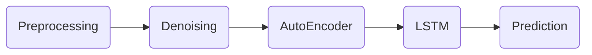

# A deep learning framework for financial time

주식 데이터 예측에 LSTM이 이전 종가를 그대로 다음 날 종가로 예측하는 lagging 현상을 줄이고자 위 논문을 재구현했습니다. 

### requirements.txt
-----
pandas~=1.0.3  
pyqt5~=5.15.0  
rootpath~=0.1.1  
numpy~=1.18.4  
plotly~=4.7.1  
tensorflow~=2.1.0  
dtw~=1.4.0  
scikit-learn~=0.23.1  
requests~=2.23.0  
beautifulsoup4~=4.9.1  
tqdm~=4.46.1  
keras~=2.3.1  
setuptools~=46.4.0  
statsmodels~=0.11.1

### Flow Chart
-----

#### 1. Preprocessing

