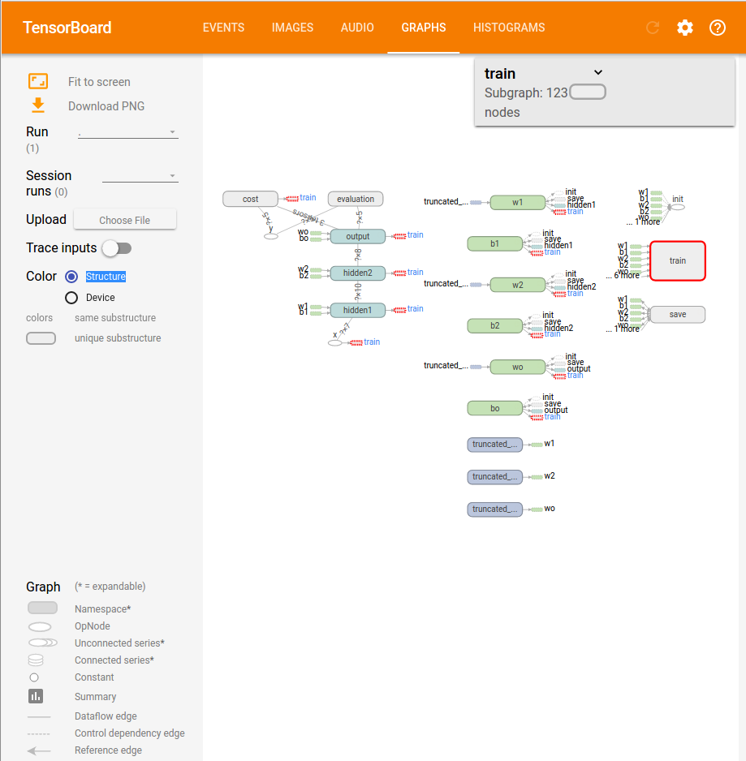

Chapter 5. 텐서보드 활용
=============================

이번에는 텐서보드를 작성하는 강의를 보았다. 저번에도 해봤지만 참 멋있는기능이라고 생각한다. 구글은 참 대단한 기업이라는 생각이 절로 나게 하는 기능이다. 

강의의 시작 부분은 파이썬의 with 문법으로 시작한다. 보통 파일 입출력에 많이 쓰이는 문법이다. close하기 귀찮을 때 자주 사용한다고 한다. 또한 텐서플로우에서도 Session을 파일로 생각해서 with 문법을 사용하는게 맞다고 한다. 예를 들면, 아래와 같이 Session을 열고 실행시킬 수 있다.

```python
with tf.Session as sess:
	_, loss, acc = sess.run([ train, cost, accuracy], feed_dict = feed_dict)
```
위와 같이 사용한다면 마지막에 굳이 Session을 닫지 않아도 된다. 즉, sess.close() 함수를 사용하지 않아도 된다.

그렇다면 이제 2가지만 기억하면 된다. 
* scope를 지정한다.
* summary를 합치고 그래프를 그린다.

scope를 지정하는 코드의 예를 들어보자.
```python
with tf.name_scope('hidden1') as h1_scope:
	hidden1 = tf.sigmoid(tf.matmul(x, w1) + b1, name='hidden1')
with tf.name_scope('hidden2') as h2_scope:
	hidden2 = tf.sigmoid(tf.matmul(hidden1, w2) + b2, name='hidden2')
with tf.name_scope('output') as o_scope:
	y = tf.sigmoid( tf.matmul( hidden2, wo ) + bo , name='y')

with tf.name_scope('cost') as scope:
	cost = tf.reduce_mean(-y_ * tf.log(y) - (1-y)*tf.log(1-y))

with tf.name_scope('train'):
	train = tf.train.GradientDescentOptimizer(Learning_Rate).minimize(cost)
with tf.name_scope('evaluation'):
	comp_pred = tf.equal(tf.arg_max(y,1) , tf.arg_max(y_, 1 ))
	accuracy = tf.reduce_mean(tf.cast(comp_pred, dtype= tf.float32))
```
그리고 싶은 변수에 scope 이름만 지어주면 된다.

변수에 scope를 설정했다면 이제 summay를 합치고 그래프를 그리는 예를 들어보자.
```python
with tf.Session() as sess:
	init = tf.global_variables_initializer() 
	sess.run(init)
	merge = tf.summary.merge_all()
	for step in range(1000):
		_, loss, acc = sess.run([train, cost, accuracy], feed_dict = feed_dict)
		if step % 100 == 0:
			train_writer = 	tf.summary.FileWriter('../summaries/4.summaries',sess.graph)
			saver.save(sess, "../ckpt/4.model")
			print("step : ",step)
			print("loss : ",loss)
			print("acc : ",acc)
```
위에서 중요한 코드는 train_writer와 merge 부분이다. 원래 코드에 2줄을 추가했을 뿐인데 그래프가 그려지는 놀라운 효과를 보인다.

강의를 보고 따라했더니 중요한 함수 2개가 이름이 바뀌어서 텐서보드가 그려지지 않았다. 정확한 원인이 그 함수인지는 모르겠지만 이름을 바꿔주는 그래프가 보였다. 위 코드들은 최근 텐서플로우가 지원하는 함수로 바꾼 코드이다. 


